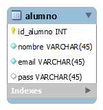

# CRUD clase.sql

Es una aplicacion diseñada para hacer un CRUD completo para la bbdd de clase.sql.
Un CRUD se compone de

- LISTAR
- INSERTAR 
- MODIFICAR 
- ELIMINAR

## base de datos.

la base de datos de clase es solo una tabla con cuatro columnas:

- id alumno
- nombre (del aulumno)
- email
- contraseña

## funcionamiento

La funcion muestra una lista de opciones del 1 al 4 siendo:

- LISTAR = 1
- INSERTAR = 2
- MODIFICAR = 3
- ELIMINAR = 4
- SALIR = 0

###Listar:
###Insertar:
###Modificar:
###Eliminar:
###Salir:

