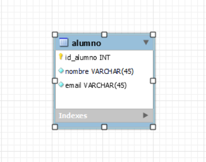

# jbdc

Proyecto **JAVA** contra una Base de Datos **MySQL** para gestionar los alumnos mediante sentencias **CRUD** de SQL.

## Descripcion

Lorem ipsum dolor sit amet consectetur, adipiscing elit vel vitae lacus tristique, sociis malesuada nec blandit. Molestie dui varius at pharetra id congue nibh, etiam taciti ut class interdum viverra neque, egestas nunc fermentum justo fringilla elementum. Etiam dapibus tristique nec justo rhoncus per lacus faucibus sapien arcu massa ridiculus, fermentum taciti mollis facilisi vehicula nam blandit varius euismod sed venenatis, habitant donec molestie netus potenti dis ut pellentesque risus auctor cursus

## Tecnologias que se han usado

- MySql
- Java 8
- Maven

## Montaje y ejecucion

Lorem ipsum dolor sit amet consectetur, adipiscing elit vel vitae lacus tristique, sociis malesuada nec blandit. Molestie dui varius at pharetra id congue nibh, etiam taciti ut class interdum viverra neque, egestas nunc fermentum justo fringilla elementum. Etiam dapibus tristique nec justo rhoncus per lacus faucibus sapien arcu massa ridiculus, fermentum taciti mollis facilisi vehicula nam blandit varius euismod sed venenatis, habitant donec molestie netus potenti dis ut pellentesque risus auctor cursus

## Diagrama BBDD

Disponemos de una bbdd en MySql. En este [enlace](https://github.com/elorrieta-errekamari-institutua/AppClase/blob/javier_ibon/clase.sql) se puede ver el script

A continuacion se muestra una imagen con la composicion de la tabla que utilizamos

## Versiones

Lorem ipsum dolor sit amet consectetur, adipiscing elit vel vitae lacus tristique, sociis malesuada nec blandit. Molestie dui varius at pharetra id congue nibh, etiam taciti ut class interdum viverra neque, egestas nunc fermentum justo fringilla elementum. Etiam dapibus tristique nec justo rhoncus per lacus faucibus sapien arcu massa ridiculus, fermentum taciti mollis facilisi vehicula nam blandit varius euismod sed venenatis, habitant donec molestie netus potenti dis ut pellentesque risus auctor cursus

