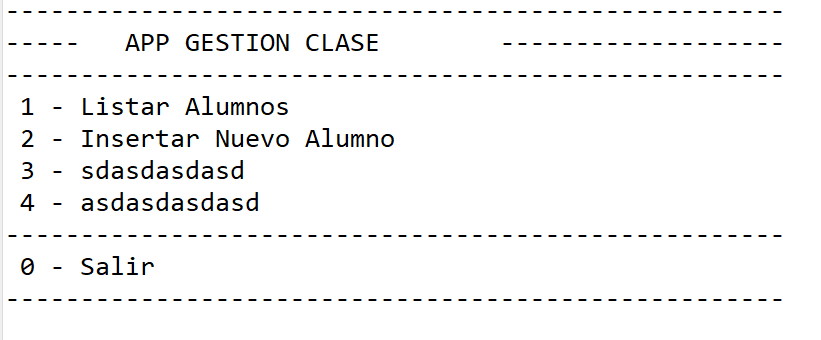
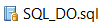
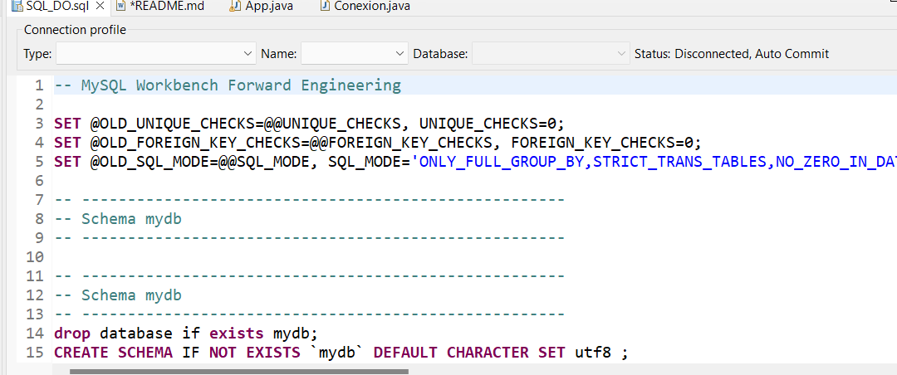
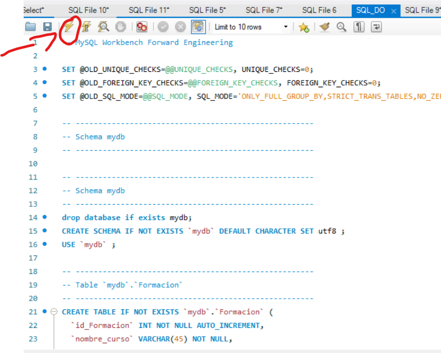
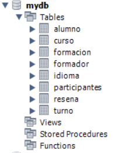

# Bienvenido al programa de gestion de clase!

Con este programa se podran hacer hasta 4 acciones:

1. Listar Alumnos.

2. Insertar nuevo Alumno.

3. Modificar.

4. Eliminar. 

## Listar Alumnos

Con esta opcion podemos listar todos los alumnos cos sus
ID, nombre y email.

## Insertar nuevo Alumno

Con esta opcion podremos ingresar un nuevo
alumno al sistema introduciendo su Id, nombre y email.

## Modificar

Con esta opcion, introduciendo el ID del alumno que
queremos modificar se podra cambiar el nombre
y el email asociados.

## Eliminar

Con la opcion eliminar, introduciendo el ID
del alumno se podra eliminar de la base de datos.

### Como usar la Base de Datos

Lo primero, debe tener instalado Worbench o una variante para el uso de MySQL,
despues debe ir al sql llamado SQL_DO el cual se encuentra dentro del programa
dentro de dicho sql tendra el codigo necesario para la creacion de la base de datos,
solo tendra que copiar el codigo y introducirlo dentro de Worbench, una vez echo tendra
que darle al simbolo del rayo para crearlo, es entonces cuando debera iniciar el programa.

