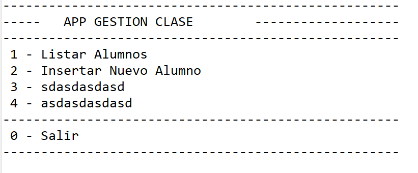

# jbdc

Proyecto **JAVA** contra una Base de Datos **MySQL** para gestionar los alumnos mediante sentencias **CRUD** de SQL.

## Descripcion

En primera instancia se debe introducir un usuario y una contraseña valida para poder acceder al menu principal. Si los credenciales son incorrectos se volveran a pedir.
Una vez dentro, lo primero que se ve es un menu con 4 opciones mas la opcion de salir

El usuario podra Listar los alumnos que estan registrados en la bbdd (opcion 1)

Insertar un nuevo alumno con los campos nombre e email (opcion 2)

Modificar un alumno existente en la bbdd, introduciendo su id y dando un nuevo nombre e email (opcion 3)

Borrar un alumno de la bbdd introduciendo una id (opcion 4)

Y salir del programa (opcion 0)

## Tecnologias que se han usado

- MySql
- Java 8
- Maven 4.0.0

## Montaje y ejecucion

Lorem ipsum dolor sit amet consectetur, adipiscing elit vel vitae lacus tristique, sociis malesuada nec blandit. Molestie dui varius at pharetra id congue nibh, etiam taciti ut class interdum viverra neque, egestas nunc fermentum justo fringilla elementum. Etiam dapibus tristique nec justo rhoncus per lacus faucibus sapien arcu massa ridiculus, fermentum taciti mollis facilisi vehicula nam blandit varius euismod sed venenatis, habitant donec molestie netus potenti dis ut pellentesque risus auctor cursus

## Diagrama BBDD

Disponemos de una bbdd en MySql. En este [enlace](https://github.com/elorrieta-errekamari-institutua/AppClase/blob/javier_ibon/clase.sql) se puede ver el script

A continuacion se muestra una imagen con la composicion de la tabla que utilizamos

## Versiones

Lorem ipsum dolor sit amet consectetur, adipiscing elit vel vitae lacus tristique, sociis malesuada nec blandit. Molestie dui varius at pharetra id congue nibh, etiam taciti ut class interdum viverra neque, egestas nunc fermentum justo fringilla elementum. Etiam dapibus tristique nec justo rhoncus per lacus faucibus sapien arcu massa ridiculus, fermentum taciti mollis facilisi vehicula nam blandit varius euismod sed venenatis, habitant donec molestie netus potenti dis ut pellentesque risus auctor cursus

