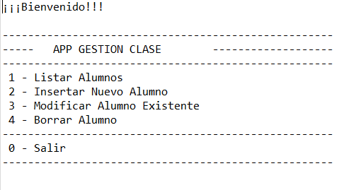

# GESTIÓN DE ALUMNOS

Proyecto **JAVA** contra una Base de Datos **MySQL** para gestionar los alumnos mediante sentencias **DML** de SQL.


## Descripcion

En primera instancia se debe introducir un usuario y una contraseña válida para poder acceder al menú principal. Si los credenciales son incorrectos se volverán a pedir y no dejara acceder.

Para poder ejecutar el programa debemos loguearnos con el **[User: admin] [password: admin]**

Una vez dentro, lo primero que se ve es un menú con 4 opciones más la opción de salir



El usuario podrá: 

Listar los alumnos que estan registrados en la bbdd (opción 1)

Insertar un nuevo alumno con los campos nombre e email (opción 2)

Modificar un alumno existente en la bbdd, introduciendo su id y dando un nuevo nombre e email (opción 3)

Borrar un alumno de la bbdd introduciendo una id (opción 4)

Y salir del programa (opción 0)


## Tecnologías que se han usado

- MySql
- Java 8
- Maven 4.0.0

## Montaje y conexión

Al ser un proyecto JAVA contra una BBDD vamos a necesitar un programa de gestión de BBDD, en nuestro caso hemo utilizado **MySQL Workbench**.

Un dato a tener en cuenta es tener bien **la url de conexión** con la BBDD, la conexion se especifica en la clase **com.elorrieta.clase.Conexión**

```
	DriverManager.getConnection("jdbc:mysql://localhost:3306/clase?useSSL=false", "root", "root");
```


## Diagrama BBDD

Disponemos de una bbdd en MySql. En este [enlace](https://github.com/elorrieta-errekamari-institutua/AppClase/blob/javier_ibon/clase.sql) se puede ver y descargar el script para montar en tu programa de gestión de BBDD.

A continuación se muestra una imagen con la composición de la tabla que utilizamos


## Versiones

La version actual del proyecto es la inicial, 1.0.0.


## Iniciar programa

Para iniciar el programa debemos ejecutar como una aplicacion java la clase **com.elorrieta.clase.App**.

Es la clase donde se encuentra el main del programa. 

Pra cerrar el programa tienes que pulsar 0 en el menú principal.